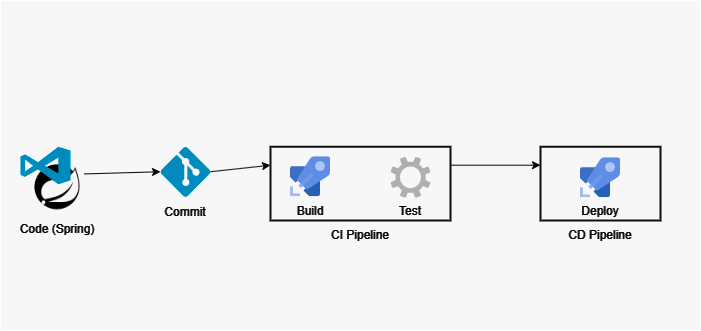

# Solução 
- Desenvolvimento de um sistema de provador virtual baseado em tecnologia de realidade aumentada que permitirá que os clientes experimentem virtualmente as roupas antes de fazer a compra.
- Objetivo do projeto: Reduzir a necessidade de trocas e aumentar a satisfação dos clientes ao realizar a compra do produto, permitindo que eles saibam como a roupa ficará neles antes da compra.
- Problema comum na indústria da moda: a insatisfação dos clientes com suas compras devido ao tamanho ou ao caimento da roupa. Essa insatisfação muitas vezes leva à necessidade de trocas, o que pode ser uma experiência frustrante tanto para o cliente quanto para a empresa.
- Benefícios para os clientes: os clientes poderão visualizar como a roupa ficará em seu corpo em tempo real, o que reduzirá a incerteza e a necessidade de trocas, aumentando a satisfação com suas compras.
- Benefícios para a empresa: a solução inovadora reduzirá o impacto ambiental das devoluções de produtos, melhora a eficiência e rentabilidade da empresa e pode levar a um aumento no número de vendas de certos produtos. Uma API para o sistema de controle de gastos pessoais.


# How To

- 1º Você irá acessar o seu Azure DevOps 
- 2º Em Repos, você irá importar o repositório que está sua aplicação.

## Para importar 
- 1º Na parte superior você irá encontrar o nome da equipe que você criou, ao clicar irá aparecer algumas opções e você irá em `Import Repository`
- 2º Você irá adicionar o link do repositório do GitHub onde está sua aplicação e apertara em importar. Após importar nós iremos para criação da pipeline

## CI Pipelines
### Build
- 1º Você irá apertar na opção de `New Pipeline` e irá na última opção escrita `Use the classic editor`
- 2º Você irá dizer qual o repositório e branch você estará fazendo o build
- 3º Irá selecionar o template do seu projeto, no nosso caso iremos utilizar Maven e ali iremos configurar nossa Pipeline conforme está no nosso arquivo <a href="https://github.com/lucasmoraisnt/WeAr-Digital/blob/main/DevOps/pipeline.yaml">YAML</a>
- 4º Após finalizar as configurações você irá salvar e rodar o build

## CD Pipeline
### Deploy
- 1º Vamos criar uma nova release clicando em `New Release` 
- 2º Você irá escolher o template que irá trabalhar, no nosso caso será o `Azure App Service deployment` e poderá dar um nome para o Stage
- 3º Em `Artifacts` você irá adicionar o Build que nós criamos
- 4º Em Pre-Deployment Conditions você irá ativar o filtro do artefato e adicionar a branch principal que você está utilizando
- 5º Em `1 job, 1 task` vamos fazer as configurações do Stage 1
- 6º Em `Azure subscription` você irá adicionar a sua Assinatura da Azure
- 7º Em `App service name` você irá adicionar o nome do App Service que criou (é necessário que esteja exatamente igual)
- 8º Dentro de Run on agent vamos deixar o `Agent pool` como `Azure Pipelines` e `Agent Specification` como `windows-latest`
- 9º Em `Variables` podemos adicionar um Objeto chamado "Server" e que irá armazenar o valor "myserver.com.br"
- 10º Por último iremos salvar no release e apertar em `Create Release` para poder rodar ela, ao finalizar o deploy basta entrar em Logs > Web App Deploy, e procurar pela linha `App Service Application URL` e por lá você poderá testar sua aplicação online

## Endpoints
- Experimentar
    - [Cadastrar](#cadastrar-experimentar)
    - [Listar todas](#listar-experimentar)
    - [Apagar](#apagar-experimentar)
    - [Alterar](#alterar-experimentar)
    - [Mostrar os detalhes](#detalhar-experimentar)
- Roupa
    - [Cadastrar](#cadastrar-roupa)
    - [Listar todas](#listar-roupa)
    - [Apagar](#apagar-roupa)
    - [Alterar](#alterar-roupa)
    - [Mostrar os detalhes](#detalhar-roupa)

---

### Cadastrar Experimentar
`POST` /api/experimentar

| campo | tipo | obrigatório | descrição
|-------|------|:-------------:|--
| roupa_id | int | sim | é o id de uma roupa previamente cadastrada
| data | data | sim | é data do cadastro de experimentar
| descricao | texto | não | uma descrição com no máximo 255 caracteres
| cor | lista | não | são as cores disponíveis para a roupa
| tamanho | lista | não | são os tamanhos disponíveis para a roupa

**Exemplo de corpo do request**

```js
{
    "roupa_id" : 1,
    "data": "2023-01-01",
    "descricao": "Calça camuflada",
    "cor": ["Azul", "Preto"],
    "tamanho": ["P", "M", "G"]
}
```

**Códigos de Resposta**

| código | descrição 
|-|-
| 201 | experimentar cadastrado com sucesso
| 400 | erro na validação dos dados da requisição

---

### Detalhar Experimentar
`GET` /api/experimentar/{id}

**Exemplo de corpo da resposta**

```js
{
    "roupa": {
        "roupa_id" : 1,
        "nome": "Camiseta"
    },
    "data": "2023-01-01",
    "descricao": "camiseta de praticar esportes",
    "cor": ["Branco","Preto", "Azul"],
    "tamanho": ["P", "M", "G"]
}
```

**Códigos de Resposta**

| código | descrição 
|-|-
| 200 | dados retornados no corpo da resposta
| 404 | não foi encontrada roupa com o id informado

---

### Listar Experimentar
`GET` /api/experimentar

**Exemplo de corpo da resposta**

```js
{
    "roupa": {
        "roupa_id" : 1,
        "nome": "Camiseta"
    },
    "data": "2023-01-01",
    "descricao": "camiseta de praticar esportes",
    "cor": ["Branco", "Preto", "Azul"],
    "tamanho": ["P", "M", "G"]
},
{
    "roupa": {
        "roupa_id" : 2,
        "nome": "Shorts"
    },
    "data": "2023-01-01",
    "descricao": "shorts de praticar esportes",
    "cor": ["Branco", "Preto"],
    "tamanho": ["P", "M", "G"]
}
```

**Códigos de Resposta**

| código | descrição 
|-|-
| 200 | dados retornados no corpo da resposta
| 404 | não foi encontrada roupa com o id informado

---

### Apagar Experimentar
`DELETE` /api/experimentar/{id}

**Exemplo de corpo da resposta**

```js
{
    "mensagem": "Roupa apagada com sucesso"
}
```

**Códigos de Resposta**

| código | descrição 
|-|-
| 200 | dados apagados com sucesso
| 404 | não foi encontrada roupa com o id informado

---

### Alterar Experimentar
`PUT` /api/experimentar/{id}

**Exemplo de corpo da resposta**

```js
{
    "mensagem": "Roupa atualizada com sucesso"
}
```

**Códigos de Resposta**

| código | descrição 
|-|-
| 200 | dados atualizados com sucesso
| 404 | não foi encontrada roupa com o id informado

---


### Cadastrar Roupa
`POST` /api/ropupa

| campo | tipo | obrigatório | descrição
|-------|------|:-------------:|--
| id | int | sim | é o id de uma roupa
| nome | texto | sim | é o nome da roupa
| codigo | texto | sim | é o código da roupa
| preco | int | sim | é o preço da roupa
| cor | lista | não | são as cores disponíveis para a roupa
| tamanho | lista | não | são os tamanhos disponíveis para a roupa

**Exemplo de corpo do request**

```js
{
    "id" : 1,
    "nome": "Camiseta",
    "codigo": "123",
    "preco": 50,00,
    "cor": ["Azul", "Preto"],
    "tamanho": ["P", "M", "G"]
}
```

**Códigos de Resposta**

| código | descrição 
|-|-
| 201 | experimentar cadastrado com sucesso
| 400 | erro na validação dos dados da requisição

---

### Detalhar Roupa
`GET` /api/roupa/{id}

**Exemplo de corpo da resposta**

```js
{
    "roupa": {
        "id" : 1,
        "nome": "Camiseta"
    },
    "codigo": "123",
    "preco": 50,00,
    "cor": ["Azul", "Preto"],
    "tamanho": ["P", "M", "G"]
}
```

**Códigos de Resposta**

| código | descrição 
|-|-
| 200 | dados retornados no corpo da resposta
| 404 | não foi encontrada roupa com o id informado

---

### Listar Roupa
`GET` /api/roupa

**Exemplo de corpo da resposta**

```js
{
   "roupa": {
        "id" : 1,
        "nome": "Camiseta"
    },
    "codigo": "123",
    "preco": 50,00,
    "cor": ["Azul", "Preto"],
    "tamanho": ["P", "M", "G"]
},
{
    "roupa": {
        "id" : 2,
        "nome": "Calça"
    },
    "codigo": "321",
    "preco": 100,00,
    "cor": ["Azul", "Preto", "Branco"],
    "tamanho": ["P", "M", "G"]
}
```

**Códigos de Resposta**

| código | descrição 
|-|-
| 200 | dados retornados no corpo da resposta
| 404 | não foi encontrada roupa com o id informado

---

### Apagar Roupa
`DELETE` /api/roupa/{id}

**Exemplo de corpo da resposta**

```js
{
    "mensagem": "Roupa apagada com sucesso"
}
```

**Códigos de Resposta**

| código | descrição 
|-|-
| 200 | dados apagados com sucesso
| 404 | não foi encontrada roupa com o id informado

---

### Alterar Roupa
`PUT` /api/roupa/{id}

**Exemplo de corpo da resposta**

```js
{
    "mensagem": "Roupa atualizada com sucesso"
}
```

**Códigos de Resposta**

| código | descrição 
|-|-
| 200 | dados atualizados com sucesso
| 404 | não foi encontrada roupa com o id informado

